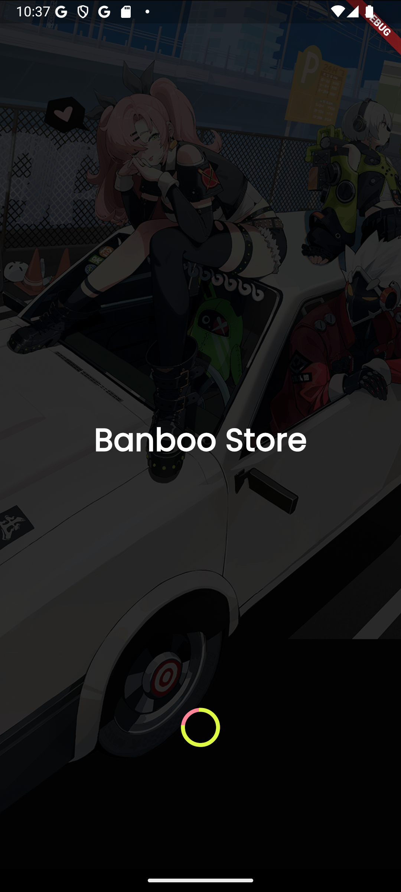
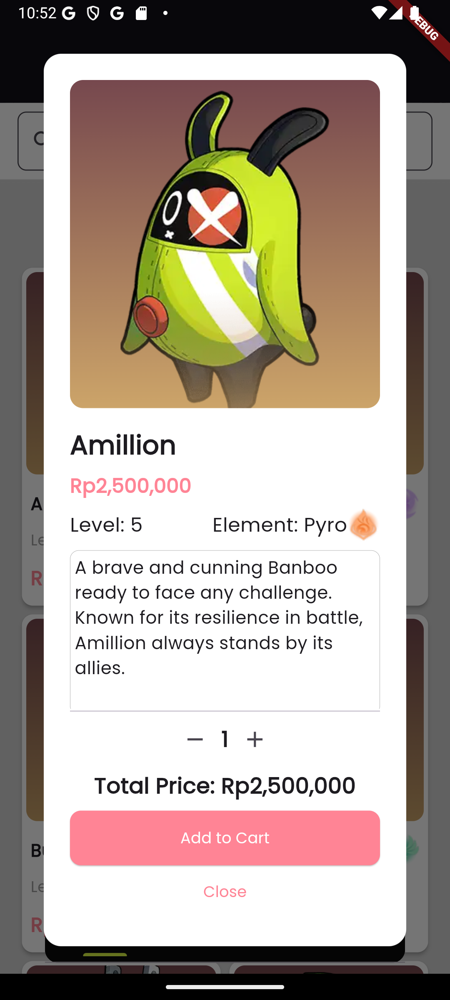

# 🎮 Banboo Store: Digital Companion Marketplace


## 📝 Project Overview

Banboo Store is an innovative digital marketplace application inspired by the Zenless Zone Zero (ZZZ) universe, offering a unique platform for digital companion trading.

### 🌟 Key Features
- Unique digital companion marketplace
- Game-inspired collectible design
- Personalized interaction experiences
- Element-based companion classification

## 🚀 Technology Stack

### Frontend
- **Framework:** Flutter 3.24.2
- **Language:** Dart
- **IDE:** Android Studio Ladybug

### Backend
- **Runtime:** Node.js v21.6.2
- **Framework:** Express.js
- **Database:** MySQL

## 🔧 Installation

### Prerequisites
- Flutter SDK 3.24.2
- Dart SDK
- Node.js v21.6.2
- MySQL

### Clone Repository
```bash
git clone https://github.com/your-username/banboo-store.git
cd banboo-store
```

### Backend Setup
```bash
cd backend
npm install
npm start
```

### Frontend Setup
```bash
cd frontend
flutter pub get
flutter run
```

## 🔐 Default Credentials
- **Admin Login:**
  - Email: `admin@zzz.com`
  - Password: `123123`

## 📱 Application Features

### User Authentication
- Secure registration
- JWT-based authentication
- Social media login
- Role-based access control

### Key Screens
1. Splash Screen
2. Login/Registration
3. Home Page
4. Banboo Details
5. Cart
6. Order History
7. Profile
8. Admin Dashboard

## 🖼️ Screenshots

<div align="center">
  
  
  
</div>

## 🔮 Upcoming Features
- Wishlist Functionality
- User Review System
- Advanced Payment Integration
- Cloud Deployment

## 👥 Development Team
- Zaky Satya Gumilang (2602206266)
- Lalu Satria Syuja Makarim (2602114126)
- Ida Bagus Swambara Suadnyana (2602124120)

## 🛡️ Security Considerations
- Encrypted Authentication
- Secure JWT Management
- Input Validation
- Regular Security Audits

## 🤝 Contribution Guidelines
1. Fork the Repository
2. Create Feature Branch
3. Commit Changes
4. Push to Branch
5. Create Pull Request

## 📄 License
This project is licensed under the MIT License - see the [LICENSE.md](LICENSE.md) file for details

## 📞 Support
- Email: support@banboostore.com
- Discord: [Banboo Store Community](https://discord.gg/banboostore)

## 🌐 Project Links
- [GitHub Repository](https://github.com/your-username/banboo-store)
- [Project Documentation](https://docs.banboostore.com)

## 💖 Acknowledgments
- Zenless Zone Zero Universe
- Flutter & Dart Communities
- Open Source Contributors

---

**Made with ❤️ by Banboo Store Development Team**

[](https://flutter.dev/)
[](https://nodejs.org/)
