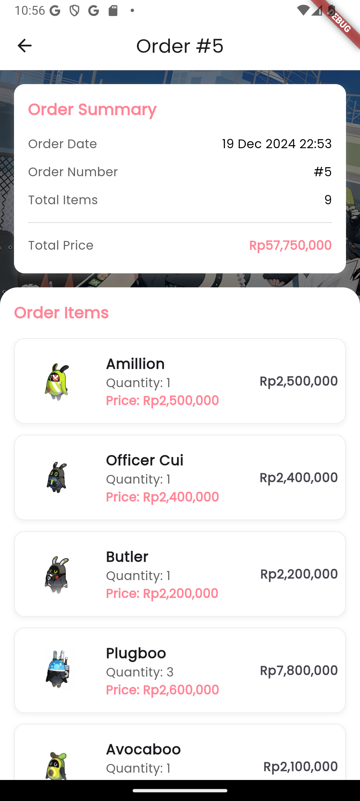
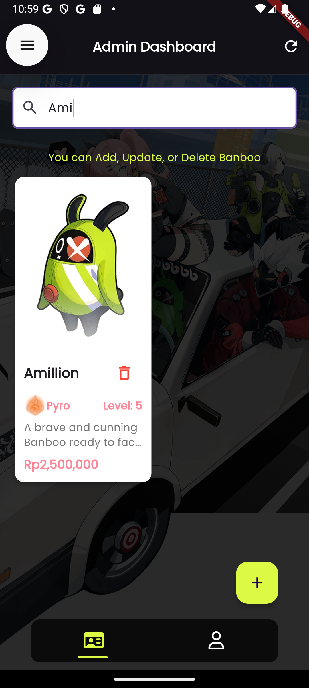

# 🎮 Banboo Store: Digital Companion Marketplace


## 📝 Project Overview

Banboo Store is an innovative digital marketplace application inspired by the Zenless Zone Zero (ZZZ) universe, offering a unique platform for digital companion trading.

### 🌟 Key Features
- Unique digital companion marketplace
- Game-inspired collectible design
- Personalized interaction experiences
- Element-based companion classification

## 🚀 Technology Stack

### Frontend
- **Framework:** Flutter 3.24.2
- **Language:** Dart
- **IDE:** Android Studio Ladybug

### Backend
- **Runtime:** Node.js v21.6.2
- **Framework:** Express.js
- **Database:** MySQL

## 🔧 Installation

### Prerequisites
- Flutter SDK 3.24.2
- Dart SDK
- Node.js v21.6.2
- MySQL

### Clone Repository
```bash
git clone [https://github.com/zakysatya/banboo-store.git]
cd banboo-store
```

### Backend Setup
```bash
cd backend
npm install
npm start
```

### Frontend Setup
```bash
cd mobile
flutter pub get
flutter run
```

## 🔐 Default Credentials
- **Admin Login:**
  - Email: `admin@zzz.com`
  - Password: `123123`

## 📱 Application Features

### User Authentication
- Secure registration
- JWT-based authentication
- Social media login
- Role-based access control

### Key Screens
1. Splash Screen
2. Login/Registration
3. Home Page
4. Banboo Details
5. Cart
6. Order History
7. Profile
8. Admin Dashboard

## 🖼️ Screenshots

## 🖼️ Application Screenshots

### 1. Authentication Flow
<div align="center">
  <div display: flex; justify-content: center; gap: 10px; style="display: inline-block; margin: 10px;">
    <h4>Splash Screen</h4>
    
  </div>
   <div style="display: inline-block; margin: 10px;">
    <h4>Onboarding Screen</h4>
    
  </div>
  <div style="display: inline-block; margin: 10px;">
    <h4>Login Page</h4>
    
  </div>
  <div style="display: inline-block; margin: 10px;">
    <h4>Registration Page</h4>
    
  </div>
</div>

### 2. Home and Exploration
<div align="center">
  <div style="display: inline-block; margin: 10px;">
    <h4>Home Dashboard</h4>
    
  </div>
  <div style="display: inline-block; margin: 10px;">
    <h4>Banboo Catalog</h4>
    
  </div>
  <div style="display: inline-block; margin: 10px;">
    <h4>Banboo Details</h4>
    
  </div>
</div>

### 3. User Interaction
<div align="center">
  <div style="display: inline-block; margin: 10px;">
    <h4>Shopping Cart</h4>
    
  </div>
  <div style="display: inline-block; margin: 10px;">
    <h4>Order Success</h4>
    
  </div>
  <div style="display: inline-block; margin: 10px;">
    <h4>Order History</h4>
    
  </div>
</div>
<div align="center">
  <div style="display: inline-block; margin: 10px;">
    <h4>Order History Detail</h4>
    
  </div>
  <div style="display: inline-block; margin: 10px;">
    <h4>User Profile</h4>
    
  </div>edit_user_profile
  <div style="display: inline-block; margin: 10px;">
    <h4>Edit User Profile</h4>
    
  </div>
</div>

### 4. Admin Management
<div align="center">
  <div style="display: inline-block; margin: 10px;">
    <h4>Admin Dashboard</h4>
    
  </div>
  <div style="display: inline-block; margin: 10px;">
    <h4>Add New Banboo</h4>
    
  </div>
  <div style="display: inline-block; margin: 10px;">
    <h4>Banboo Management</h4>
    
  </div>
</div>

### 5. Additional Features
<div align="center">
  <div style="display: inline-block; margin: 10px;">
    <h4>Wishlist</h4>
    
  </div>
  <div style="display: inline-block; margin: 10px;">
    <h4>Search Functionality</h4>
    
  </div>
</div>

## 🔮 Upcoming Features
- Wishlist Functionality
- User Review System
- Advanced Payment Integration
- Cloud Deployment

## 👥 Development Team
- Zaky Satya Gumilang
- Lalu Satria Syuja Makarim

## 🛡️ Security Considerations
- Encrypted Authentication
- Secure JWT Management
- Input Validation
- Regular Security Audits

## 🤝 Contribution Guidelines
1. Fork the Repository
2. Create Feature Branch
3. Commit Changes
4. Push to Branch
5. Create Pull Request

## 📄 License
This project is licensed under the MIT License - see the [LICENSE.md](LICENSE.md) file for details

## 💖 Acknowledgments
- Zenless Zone Zero Universe
- Flutter & Dart Communities
- Open Source Contributors

---

**Made with ❤️ by Banboo Store Development Team**

[](https://flutter.dev/)
[](https://nodejs.org/)
